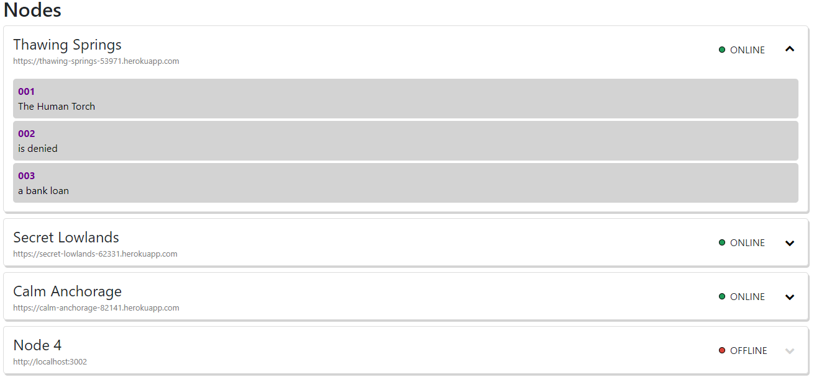
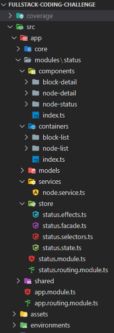
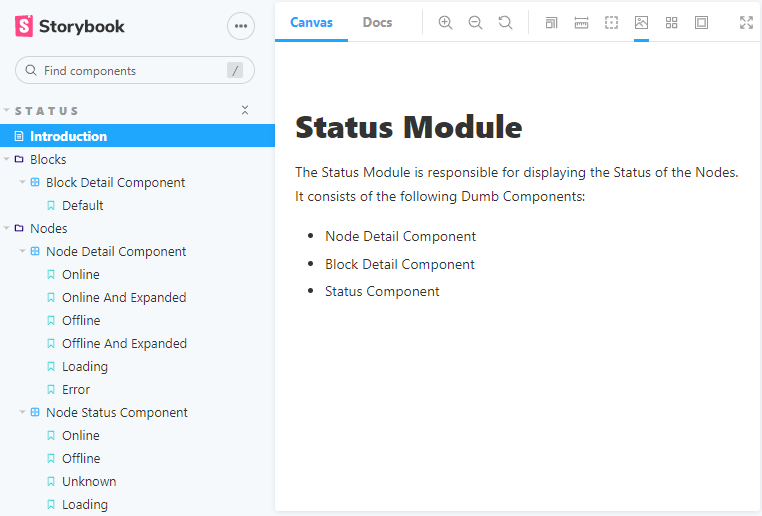

# Nodes Blocks Challenge
Fullstack Labs Coding Challenge

Date: 30.08.2021

## Development server

Run `ng serve` for a dev server. Navigate to `http://localhost:4200/`. The app will automatically reload if you change any of the source files.

## Architecture

- Store
- Services
- Container
  - Shell
  - NodeList
  - BlockList
- Components
  - NodeDetail
  - BlockDetail
  - NodeStatus

## Packages
- font-awesome
- ngx-bootstrap
- ngx-toastr

# Storybook

References:
- [StoryBook HomePage](https://storybook.js.org/)
- [Addons](https://storybook.js.org/addons/)
- [Storybook CLI](https://github.com/storybookjs/storybook/tree/next/lib/cli)
 
### Installation

- Run: `npx sb init`</code>
- Run: `npm run storybook`
- Open Storybook Website on [http://localhost:6006](http://localhost:6006)
- Remove **app/stories** folder

### VS Code Extensions
- Story Explorer (disable Live-server in settings, use live server)
- Storybook Snippets
- MDX
- MDX Inline

### Addons

Run: `npx add {addonName}`

- [console](https://storybook.js.org/addons/@storybook/addon-console/)
- [Storybook Pseudo States](https://storybook.js.org/addons/storybook-addon-pseudo-states/)
- [Viewport](https://storybook.js.org/addons/@storybook/addon-viewport/)
- [Controls](https://storybook.js.org/addons/@storybook/addon-controls/)
- [HTML preview](https://storybook.js.org/addons/@reapit/storybook-addon-html/)
- [Color picker](https://storybook.js.org/addons/storybook-color-picker/)
- [Paddings](https://storybook.js.org/addons/storybook-addon-paddings/)

### Configuration

#### Styling and CSS
- Read: [Styling and CSS](https://storybook.js.org/docs/react/configure/styling-and-css)

