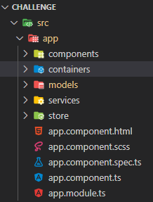

# Nodes Blocks Challenge
Fullstack Labs Coding Challenge

Date: 30.08.2021

## Development server

Run `ng serve` for a dev server. Navigate to `http://localhost:4200/`. The app will automatically reload if you change any of the source files.

## Architecture

- Store
- Services
- Container
  - Shell
  - NodeList
  - BlockList
- Components
  - NodeDetail
  - BlockDetail
  - NodeStatus

## Packages
- font-awesome
- ngx-bootstrap
- ngx-toastr
